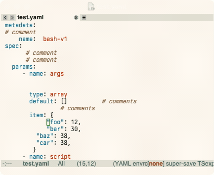
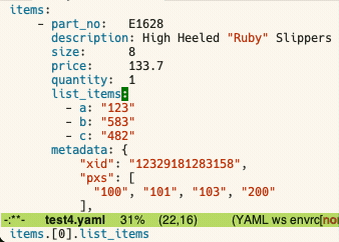
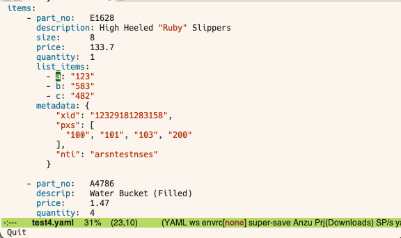
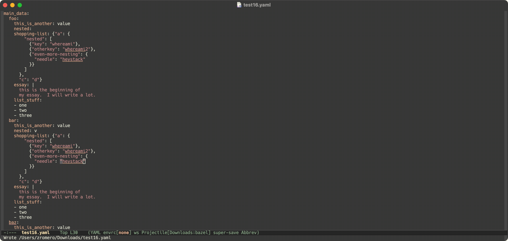

# yaml-pro: tools for editing YAML leveraging tree-sitter/parser

[](https://melpa.org/#/yaml-pro)

yaml-pro is a package that provides conveniences for editing yaml.

This package has been written to leverage **tree-sitter** parsing
facilities, allowing all of these actions to be performed fast and
accurate, even in the absence of parsing errors.  The tree-sitter
version is **orders of magnitudes faster** and I highly recommend its
usage if your Emacs version permits.


# Tree-sitter support

The latest version of yaml-pro contains tree-sitter support (activated
via `yaml-pro-ts-mode`).  In order to use this you will need to have a
version of Emacs installed that supports tree-sitter, as well as the
yaml tree-sitter parser from here:
https://github.com/ikatyang/tree-sitter-yaml . The tree-sitter
re-implementation supports everything below, as well as the following:

- **yaml-pro-ts-meta-return** (<kbd>M-return</kbd>): Add a new list
  item after the current item, similar to `org-meta-return`.
- **yaml-pro-ts-convolute-tree** (<kbd>M-?</kbd>): Swap the key of the
  current item's parent with that items parent.
- **yaml-pro-ts-mark-subtree** (<kbd>C-c @</kbd>): Mark the current
  YAML item.  If given a prefix N, mark the Nth parent above.  If
  called repeatedly, mark subsequent items.
- **yaml-pro-ts-paste-subtree** (<kbd>C-c C-x C-y</kbd>): Paste a YAML
  subtree, fixing indentation to be correct for different levels.
  When `yaml-pro-ts-yank-subtrees` is non-nil, yank will automatically
  call `yaml-pro-ts-paste-subtree` for subtrees.
- **imenu**: an index of all keys and their path are build for imenu
- **eldoc**: current path is shown as eldoc documentation. (enable
  with `eldoc-mode`)

Note that folding is not implemented.  I assume some tree-sitter
folding library will come along which will unify this feature.

Note that all the functions are infixed with "-ts-" to distinguish the
tree-sitter and non-tree-sitter variants.

# Demo

### Formatter



New in yaml-pro, a pretty formatter in Emacs Lisp powered by treesitter.

### Eldoc (tree-sitter)



### Imenu



### Subtree pasting (tree-sitter)


### Editing text in detached buffer


Never have to consult https://yaml-multiline.info/ again!  With
`yaml-pro-edit-scalar`, you can edit a scalar value in a detached
buffer and convert between the various styles with ease.

### Jump to heading (legacy parser)



You can use imenu as well.

### Moving subtrees up and down


### Folding subtrees (legacy parser)


This is not available for tree-sitter variant.  Presumably some
tree-sitter folding package will exist in the future.

### Killing subtrees


### Indenting subtrees


# Tree-sitter version

To activate the mode, run `M-x yaml-pro-ts-mode`.


In order to run the tree-sitter version of this program, you should
have a version of Emacs that supports tree-sitter, as well as the yaml
tree-sitter library installed
(https://github.com/ikatyang/tree-sitter-yaml). Ex: having the file
`libyaml.dylib` in `/usr/local/lib`.  With these in place,
`(treesit-ready-p 'yaml)` should return `t`.

## Usage

- **yaml-pro-format**
- **yaml-pro-ts-kill-subtree** (<kbd>C-c</kbd> <kbd>C-x</kbd> <kbd>C-w</kbd>)
- **yaml-pro-ts-up-level** (<kbd>C-c</kbd> <kbd>C-u</kbd>)
- **yaml-pro-ts-down-level** (<kbd>C-c</kbd> <kbd>C-d</kbd>)
- **yaml-pro-ts-next-subtree** (<kbd>C-c</kbd> <kbd>C-n</kbd>)
- **yaml-pro-ts-prev-subtree** (<kbd>C-c</kbd> <kbd>C-p</kbd>)
- **yaml-pro-ts-move-subtree-up** (<kbd>s-up</kbd>)
- **yaml-pro-ts-move-subtree-down** (<kbd>s-down</kbd>)
- **yaml-pro-ts-meta-return** (<kbd>M-<return></kbd>)
- **yaml-pro-ts-convolute-tree** (<kbd>M-?</kbd>)
- **yaml-pro-ts-indent-subtree** (<kbd>C-c</kbd> <kbd>></kbd>)
- **yaml-pro-ts-unindent-subtree** (<kbd>C-c</kbd> <kbd><</kbd>)
- **yaml-pro-ts-mark-subtree** (<kbd>C-c</kbd> <kbd>@</kbd>)
- **yaml-pro-ts-paste-subtree** (<kbd>C-c</kbd> <kbd>C-x</kbd> <kbd>C-y</kbd>)
- **yaml-pro-edit-ts-scalar** (<kbd>C-c</kbd> <kbd>'</kbd>)
  - (use prefix argument <kbd>C-u</kbd> to supply an initialization
    command to set major mode)

## Pretty formatter

yaml-pro now comes with the addition of a new formatting command
`yaml-pro-format`.  This requires tree-sitter to work.  There are
different settings you can toggle on the formatter.  For ease of
customization I recommend usind <kbd>M-x</kbd> <kbd>customize-variable</kbd>.
The following is the customization options.

- `indent` When present, indent each line by `yaml-pro-indent'.

- `reduce-newlines` When present, remove adjacent newlines so at
  most one one remains.  New lines in strings won't be removed.

- `oneline-flow` When present, reduce flow mappings to one line.

- `block-formatting` When present, format the spacing around
  block components' colons and dashes.

- `reduce-spaces` When present, attempt to reduce multiple
  adjacent space characters down to one.

- `bm-fn-next-line` When present, move the value of a key-value pair to the
  next line, indented, if it's width is longer than
  `yaml-pro-format-print-width`.

- `expand-log-flow` When present, flatten flow elements that pass
  column `yaml-pro-format-print-width`.

- `single-to-double` When present, convert single quoted strings
  to double quoted, when it wouldn't change its meaning.

- `remove-spaces-before-comments` When present, remove spaces
  before a comment until it is one space after the preceeding
  content (e.g. "a: b   # space before here").

- `clean-doc-end` When present, remove unnecessary document-end
  indicators ("...").

- `document-separator-own-line` When present, makes sure the
  document separator "---" isn't on a line with another element.

## Easy movement with repeat map

With the following configuration and repeat-mode enabled, you can
easily move around the YAML tree after executing one of the movement
commands.

```lisp
;; the original bindings will work as well, these are shorter if you prefer them.
(keymap-set yaml-pro-ts-mode-map "C-M-n" #'yaml-pro-ts-next-subtree)           ; was forward-list
(keymap-set yaml-pro-ts-mode-map "C-M-p" #'yaml-pro-ts-prev-subtree)           ; was backward-list
(keymap-set yaml-pro-ts-mode-map "C-M-u" #'yaml-pro-ts-up-level)               ; was backward-up-list
(keymap-set yaml-pro-ts-mode-map "C-M-d" #'yaml-pro-ts-down-level)             ; was down-list
(keymap-set yaml-pro-ts-mode-map "C-M-k" #'yaml-pro-ts-kill-subtree)           ; was kill-sexp
(keymap-set yaml-pro-ts-mode-map "C-M-<backspace>" #'yaml-pro-ts-kill-subtree) ; was backward-kill-sexp
(keymap-set yaml-pro-ts-mode-map "C-M-a" #'yaml-pro-ts-first-sibling)          ; was beginning-of-defun
(keymap-set yaml-pro-ts-mode-map "C-M-e" #'yaml-pro-ts-last-sibling)           ; was end-of-defun

(defvar-keymap my/yaml-pro/tree-repeat-map
  :repeat t
  "n" #'yaml-pro-ts-next-subtree
  "p" #'yaml-pro-ts-prev-subtree
  "u" #'yaml-pro-ts-up-level
  "d" #'yaml-pro-ts-down-level
  "m" #'yaml-pro-ts-mark-subtree
  "k" #'yaml-pro-ts-kill-subtree
  "a" #'yaml-pro-ts-first-sibling
  "e" #'yaml-pro-ts-last-sibling
  "SPC" #'my/yaml-pro/set-mark)

(defun my/yaml-pro/set-mark ()
  (interactive)
  (my/region/set-mark 'my/yaml-pro/set-mark))

(defun my/region/set-mark (command-name)
  (if (eq last-command command-name)
      (if (region-active-p)
          (progn
            (deactivate-mark)
            (message "Mark deactivated"))
        (activate-mark)
        (message "Mark activated"))
    (set-mark-command nil)))
```

Special thanks to @uqix for sharing this configuration.

# Legacy Parser Version

The following documentation is not applicable if you are using
`yaml-pro-ts-mode` as your entry point.  It's not recommented however
due to its slow parsing speed.

## Installation

You can install this package with MELPA under the id
`yaml-pro`. **IMPORTANT**: You have to have the latest version of
yaml.el installed or else this package won't work properly.  If your
noticing any errors try making sure that you have the correct version
of yaml.el installed (https://melpa.org/#/yaml).  You can see the
parser version with the variable `yaml-parser-version` and the
required version with the variable
`yaml-pro-required-yaml-parser-version`.

You can have yaml-pro-mode setup on yaml-mode loading with the
configuration: `(add-hook 'yaml-mode-hook #'yaml-pro-mode)`

## Usage

Run the command `yaml-pro-mode` to initialize the mode. From there you
have the following commands available (with default keybindings).

- **yaml-pro-kill-subtree** (<kbd>C-c</kbd> <kbd>C-x</kbd> <kbd>C-w</kbd>)
- **yaml-pro-up-level** (<kbd>C-c</kbd> <kbd>C-u</kbd>)
- **yaml-pro-next-subtree** (<kbd>C-c</kbd> <kbd>C-n</kbd>)
- **yaml-pro-prev-subtree** (<kbd>C-c</kbd> <kbd>C-p</kbd>)
- **yaml-pro-fold-at-point** (<kbd>C-c</kbd> <kbd>C-f</kbd>)
- **yaml-pro-unfold-at-point** (<kbd>C-c</kbd> <kbd>C-o</kbd>)
- **yaml-pro-indent-subtree** (<kbd>C-c ></kbd>)
- **yaml-pro-unindent-subtree** (<kbd>C-c <</kbd>)
- **yaml-pro-move-subtree-up** (<kbd>s-up</kbd>)
- **yaml-pro-move-subtree-down** (<kbd>s-down</kbd>)
- **yaml-pro-edit-scalar** (<kbd>C-c '</kbd>)
  - (use prefix argument <kbd>C-u</kbd> to supply an initialization
    command to set major mode)
- If your buffer is in yaml-pro-mode, `imenu` should index the entire
  buffer's paths.


*The default bindings are subject to change as this package is in beta*

## Configuration

Yaml.el, being an Emacs lisp parser, struggles with very large files.
You can configure the parser to parse a smaller section of the buffer
via a heuristic (probably error prone).  Set the custom variable
`yaml-pro-max-parse-size` to be the size of the buffer after which
such a heuristic is used.

# Recommendations

- Yaml-pro's features compliments LSP and will enhance your YAML
  editing capabilities even further.

# Roadmap

- [x] Edit yaml values in separate buffer (like org-edit-special)
  - [x] block options for how to store the string.
  - [x] save default init command on a path basis
- [x] Easy navigation (yaml-pro-jump)
- [x] Partial tree-parsing for large files
- [x] Implement internally path-at-point.
- [x] Move functionality to tree-sitter (for better error handling),
      perhaps when tree-sitter in Emacs reaches some critical mass.
- [ ] Common YAML mistakes linter
- [ ] Tools to work with various template modes.  Go-templated YAML is
      very common but greatly hinders the effectiveness of tools like
      LSP.  Is there something that could be done (even if it's kind
      of hacky) to alleviate this?

# Contributing

Have a suggestion for this package? Feel free to create an issue. I'd
love to hear others pain-points when editing YAML.
